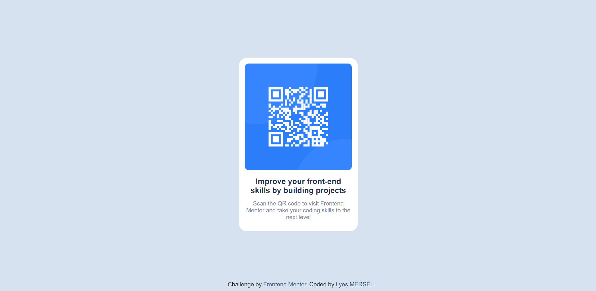

# Frontend_Mentor_Challenge_02
QR Code Component

# Frontend Mentor - QR code component solution
This is a solution to the [QR code component challenge on Frontend Mentor](https://www.frontendmentor.io/challenges/qr-code-component-iux_sIO_H). Frontend Mentor challenges help you improve your coding skills by building realistic projects. 

### Screenshot

### Built with
- HTML5
- CSS

## Author
- Website - [Lyes MERSEL](https://lyes-mersel.netlify.app)
- Frontend Mentor - [@lyes-mersel](https://www.frontendmentor.io/profile/lyes-mersel)
- LinkedIn - [@lyes-mersel](https://www.linkedin.com/in/lyes-mersel/)